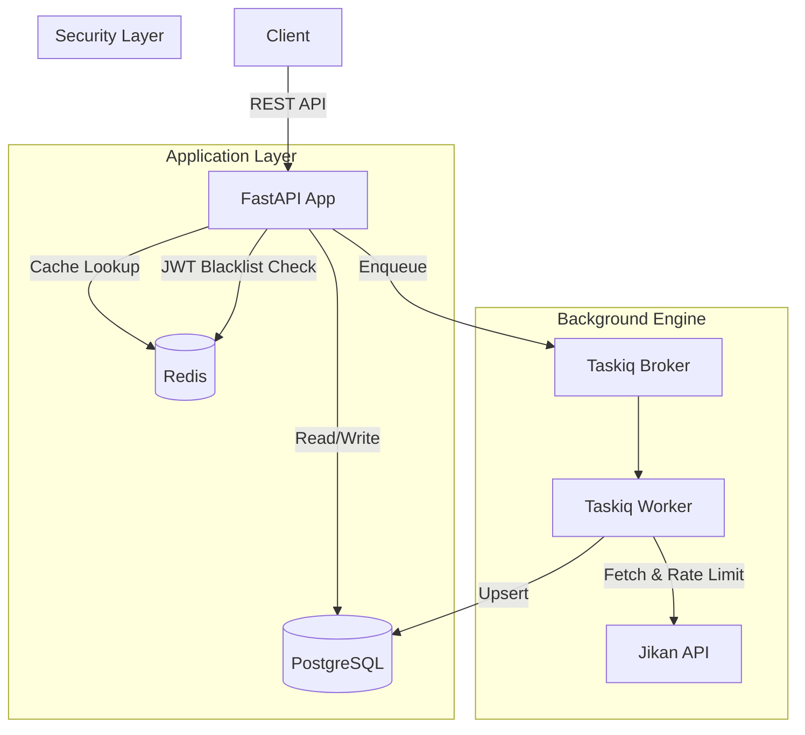

# AniSync — Async Anime Tracking API

Backend-сервис для управления персональными списками аниме с синхронизацией данных из MyAnimeList.  
Спроектирован с акцентом на асинхронность, отказоустойчивость при работе с внешними API и строгую консистентность данных.

**Stack:** Python 3.14 · FastAPI · SQLAlchemy (async) · PostgreSQL · Redis · Taskiq · Pydantic v2 · Docker Compose

---

## System Architecture

Сервис разделяет критический путь обработки запросов и ресурсоёмкие фоновые задачи синхронизации:



```
app/
├── api/            # Роуты (тонкие, без бизнес-логики)
├── services/       # Бизнес-логика
├── repositories/   # Доступ к данным (SQLAlchemy-запросы)
├── models/         # ORM-модели
├── schemas/        # Pydantic v2 request/response
├── tasks/          # Taskiq фоновые задачи
├── external/       # HTTP-клиенты (Jikan)
└── utils/          # JWT, security
```

---

## Engineering Highlights

- **Async-first** — полная асинхронность: FastAPI + SQLAlchemy async + httpx + Taskiq.
- **Background Processing** — синхронизация с Jikan API вынесена в фоновые задачи через Taskiq, не блокирует основной цикл обработки запросов.
- **Resilience** — retry с exponential backoff (tenacity, 5 попыток) + rate limiter (aiolimiter, 3 req/s) на внешние запросы. Система не падает при недоступности Jikan.
- **JWT Rotation** — access-токен (15 мин) + одноразовый refresh (7 дней). При логауте jti пишется в Redis blacklist с TTL на остаток жизни токена.
- **Cache-Aside** — при запросе аниме по MAL ID сначала проверяется локальная БД; при промахе данные подтягиваются из Jikan и кэшируются.

---

## Design Decisions & Trade-offs

| Решение | Почему так | Альтернатива |
|---------|-----------|-------------|
| **Cache-Aside** | Снижает latency на чтение, не блокирует пользователя при промахе кэша | Write-Through — проще, но создаёт лишнюю нагрузку на запись |
| **Taskiq вместо Celery** | Нативная поддержка async/await, нет overhead'а от синхронного воркера в async-приложении | Celery — зрелая экосистема, но требует синхронного контекста |
| **Atomic genre sync** | Delete + re-insert всех связей жанров при обновлении. Грубо, но гарантирует идемпотентность: повторный запуск не создаст дублей | Diff-based — эффективнее по количеству запросов, но сложнее в реализации и подвержен race conditions |
| **Одноразовые refresh-токены** | Ротация при каждом использовании. Утечка токена даёт атакующему ровно одну попытку | Многоразовые — проще, но утечка компрометирует сессию до истечения TTL |

---

## API Overview

### Auth — `/auth`

| Method | Path | Description |
|--------|------|-------------|
| POST | `/auth/register` | Регистрация |
| POST | `/auth/login` | Логин → access + refresh |
| POST | `/auth/logout` | Blacklist access-токена |
| POST | `/auth/refresh` | Ротация refresh-токена |

### Users — `/users`

| Method | Path | Description |
|--------|------|-------------|
| GET | `/users/me` | Текущий пользователь |
| GET | `/users/me/list` | Список аниме (фильтр `?status=watching`) |
| POST | `/users/me/list` | Добавить аниме в список |
| PATCH | `/users/me/list/{anime_id}` | Обновить запись |
| DELETE | `/users/me/list/{anime_id}` | Удалить из списка |
| GET | `/users/me/recommendations` | Рекомендации по жанрам |

### Anime — `/anime`

| Method | Path | Description |
|--------|------|-------------|
| GET | `/anime/` | Каталог с фильтрами (жанр, сезон, год, оценка, поиск) |
| GET | `/anime/{anime_id}` | По внутреннему ID |
| GET | `/anime/mal/{mal_id}` | По MAL ID (cache-aside) |
| POST | `/anime/sync/{mal_id}` | Фоновый синк одного тайтла |
| POST | `/anime/sync/top` | Фоновый синк топа |

---

## Getting Started

```bash
# Клонировать и запустить
git clone https://github.com/Flaty/AniSync.git
cd AniSync
docker-compose -f docker-compose.dev.yml up

# Накатить миграции (в отдельном терминале)
docker exec -it anisync_dev uv run alembic upgrade head
```

Taskiq worker поднимается автоматически как отдельный сервис в Docker Compose.

### Environment

Два `.env` файла: корневой (для Docker) и `app/.env` (для локальной разработки).

| Переменная | Обязательна | Описание |
|-----------|:-----------:|---------|
| `DATABASE_URL` | да | PostgreSQL connection string |
| `REDIS_URL` | да | Redis connection string |
| `JWT_SECRET` | да | Секрет для подписи JWT. Без неё приложение упадёт при старте — это намеренно |

---

## Roadmap

- [ ] Интеграционные тесты (pytest + httpx AsyncClient)
- [ ] Prometheus-метрики (RPS, latency, queue length)
- [ ] Нагрузочное тестирование (Locust)
- [ ] CI/CD pipeline (GitHub Actions: lint + test)
